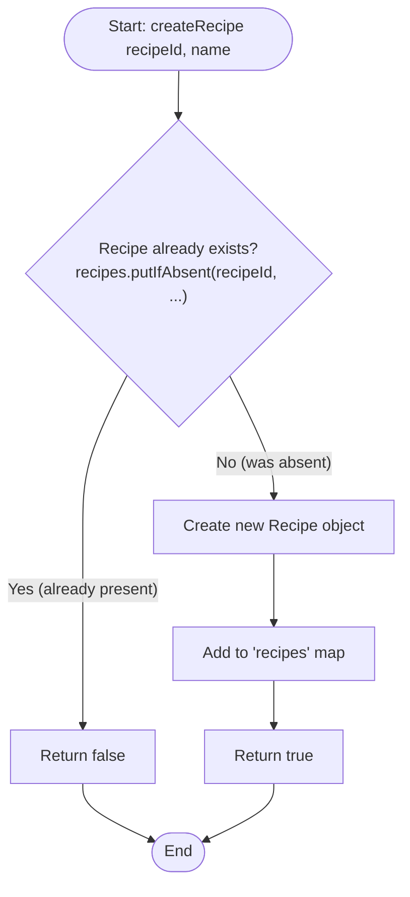
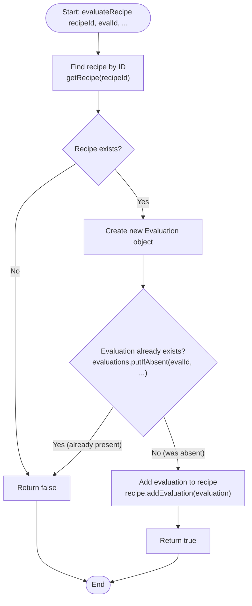
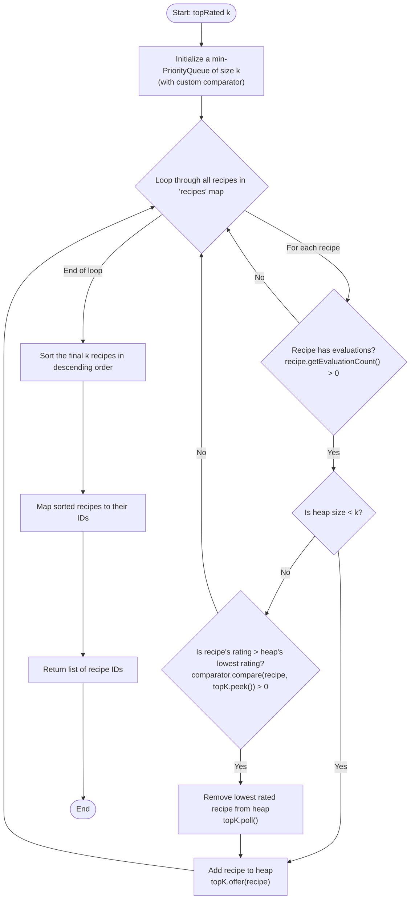
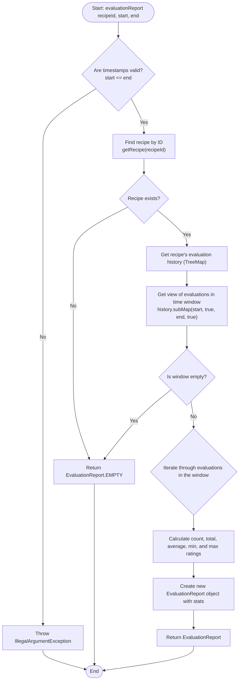

# Mermaid Diagrams

This document contains Mermaid diagrams illustrating the flow of the main algorithms in the Recipe Management System.

## Flow - createRecipe

---

## Flow - evaluateRecipe

---

## Algorithm - topRated(k)

---

## Algorithm - evaluationReport

---